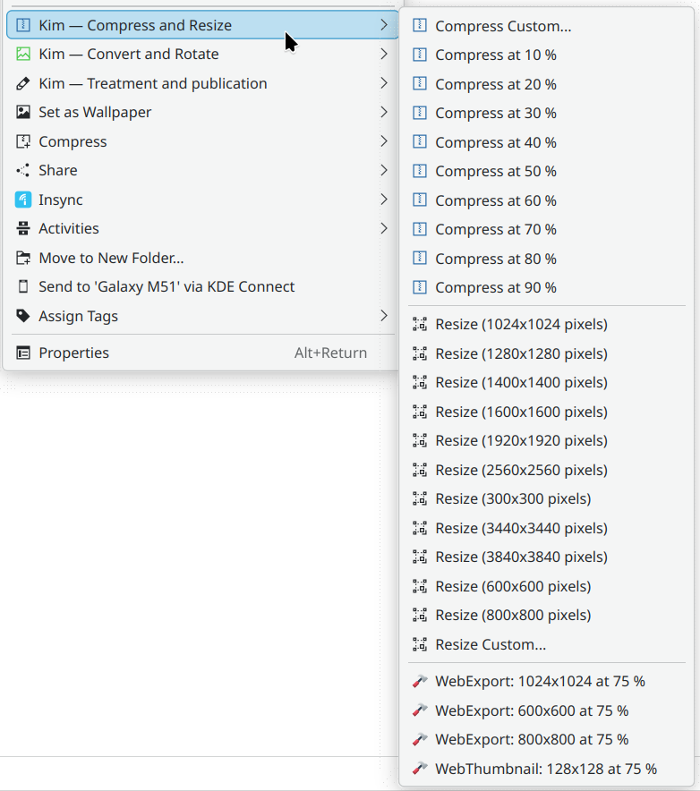

# KDE Image Menu 6 — KIM6

This is a service menu for the KDE desktop. It displays a context menu entry for images (and for video too, though there it only resizes it) in Dolphin and in Folder View (Desktop) and other software.

Here is the KDE store link: https://store.kde.org/p/2307290/



## Dependencies
- Dolphin, KDialog and QT.
- ImageMagick.
- FFmpeg is used for video conversion (image manipulation will work without it).
- xdg-email for sending pictures by e-mail, which is usually in `xdg-utils` (Everything but sending by e-mail will work.)

## Install

1. The best way is to download directly from Doplhin's settings. Note that you might need to select different sorting for KIM6 to appear due to this bug: https://bugs.kde.org/show_bug.cgi?id=508140 

2. Another way is to download the latest release as a tar.gz file from https://github.com/KIM-6/kim6/releases.
   Then run:
```
servicemenuinstaller install ./kim6*.tar.gz
```
3. You can also clone the project using git or untar the downloaded archive and run the install manually:
```
cd kim6/
./install.sh
```

## Uninstall
Best do it the same way you installed it.
1. Best done through Dolphin, though the uninstall might have to be done twice due to a bug: https://bugs.kde.org/show_bug.cgi?id=508142
2. Alternatively  locate the archive from which you installed. Dolphin saves the archive into `~/.local/share/servicemenu-download`, if you installed manually, it does not get saved there (instead the archive is extracted in the directory where it is located). Then run:
```
servicemenuinstaller uninstall PATH_TO_INSTALL_ARCHIVE.tar.gz 
```

3. You can also run the uninstall script manually. Locate it and run:
```
./uninstall.sh
```

## History
- KIM6 is a fork for KDE 6 of KIM5: https://github.com/caco3/kim5 
- One KDE4 fork is here: https://store.kde.org/p/998188/
- The original version for KDE4 is here: https://store.kde.org/p/1126887/
- KIM itself goes as far back as KDE 3. There is a website that was still functioning in 2025: http://bouveyron.free.fr/kim/index.html
- A huge majority of the code is from the original authors, thanks to them!

## See also
There is functionally similar but independent project: https://github.com/irfanhakim-as/kde-service-menu-reimage

# Develper and translator information
## Translations
To submit a new translation, just run `msginit -l XX` in the po directory (replace "XX" with the shortcut of your language) and translate the strings there. Then open an issue here with the resulting file as an attachment to submit it or better create a pull request. Current wrong or incomplete translations can be done by directly editing the po files and opening pull requests.

To test your translation, install it (see release) and run Dolphin like this (replace your new language, this is for Dutch):
```
LANGUAGE=nl dolphin
```

To generate new `.pot` template and update the individual translations, one runs this in `po` directory (unless you develop a new feature, you should not need this as I try to keep the translation strings up-to-date):
```
VERSION=1.1; # set kim6 version
cd po;
# this creates a new pot file from the files in the bin directory (do not update because then deleted strings are kept)
xgettext --language=Shell --keyword=gettext --output=kim6.pot --from-code=UTF-8 --add-comments=TRANSLATORS --package-name="KIM 6 — Kde Image Menu 6" --package-version="$VERSION" --msgid-bugs-address="https://github.com/KIM-6/kim6/issues" ../src/bin/kim_*
# this gets strings from the desktop.in files, one needs to first extract the strings before gettext can recognize them, that creates header files and so comments about string locations are then wrong in the po and pot files
for desk_ini in ../src/*.desktop.in;
do intltool-extract --type=gettext/ini "$desk_ini";
xgettext --keyword=N_:1 --join-existing --output kim6.pot --from-code=UTF-8 --package-name="KIM 6 — Kde Image Menu 6" --package-version="$VERSION" --msgid-bugs-address="https://github.com/KIM-6/kim6/issues" "$desk_ini".h;
# the header files are just temporary
rm "$desk_ini".h;
done;
# % in the strings causes gettext to include this warning that we get rid of
grep -v '^#, no-c-format' kim6.pot > temp.pot;
mv temp.pot kim6.pot;
# with the resulting pot file, we can update the po files in case there are new strings or some got deleted
for po in *.po; do msgmerge --update "$po" kim6.pot;
done
```
## Release
Do not forget to update translations and changelog and then run the following in the root directory:
```
VERSION=2.0; # set kim6 version
# generate desktop files
cd po;
for desk_ini in ../src/*.desktop.in; do intltool-merge --desktop-style ./ "$desk_ini"  "${desk_ini%.in}"; chmod +x "${desk_ini%.in}" ; done
cd ..;
# Do not include files that need not be installed
tar -czf kim6_$VERSION.tar.gz --exclude=README.md  --exclude=KIM6.png --exclude=Changelog --exclude kim6_devel.tar.gz --exclude './src/*desktop.in' ./
# generated desktop files are no longer needed
rm src/kim_compressandresize.desktop src/kim_compressandresizevideo.desktop src/kim_convertandrotate.desktop src/kim_publication.desktop
```

After making the archive, it is manually uploaded here to Github and then to https://store.kde.org/p/2307290/.

## Developement
Try to make a release (see above) and then try your changes changes with:
```
servicemenuinstaller install kim6_$VERSION.tar.gz
```
Then clean up with:
```
servicemenuinstaller uninstall kim6_$VERSION.tar.gz
```

It is also possible to run directly the `.install.sh` and `.uninstall.sh` scripts, the desktopfiles will be generated automatically. 

Individual scripts can also be ran directly. Look into the bin files (which are bash scripts) to see what arguments they need. For example this resizes proportionally a given file 300 pixels along its shorter side:
```
./kim_resize ~/example.jpg 300x300
```

## Todo

- Update manual (pointing to old site etc.)
- Merge bin files and refactor common code is in functions, that should reduce the code size in half
