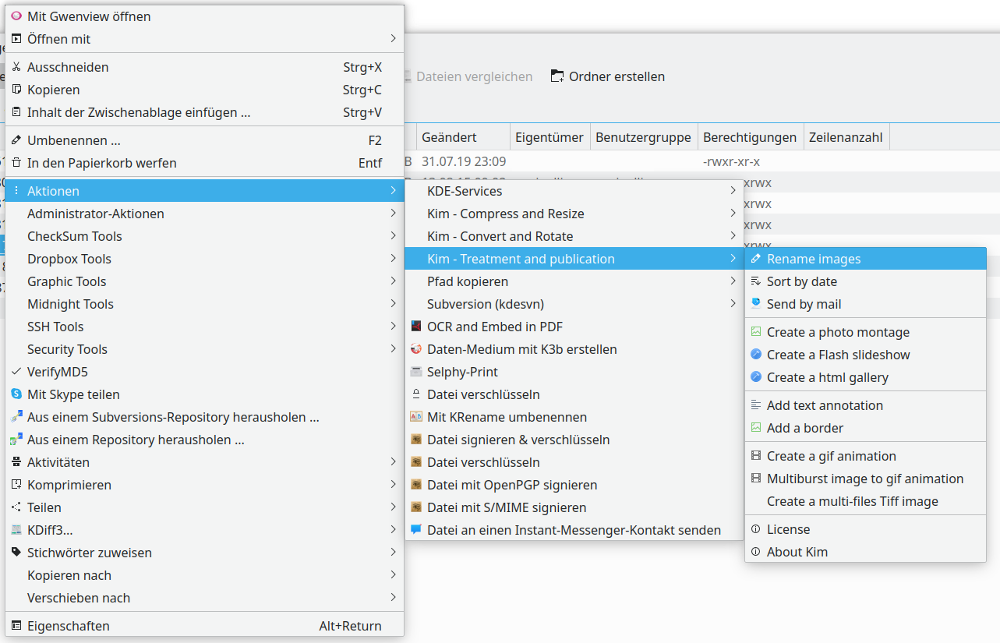

# Images Service menu für Dolphin (KF5)

This is a port and refactoring of the no longer maintained KIM for KDE4, see https://www.linux-apps.com/content/show.php?content=11505




## Install

1. Download or clone the project
2. Run the following code:

```
cd kim/
sudo ./install.sh
```
